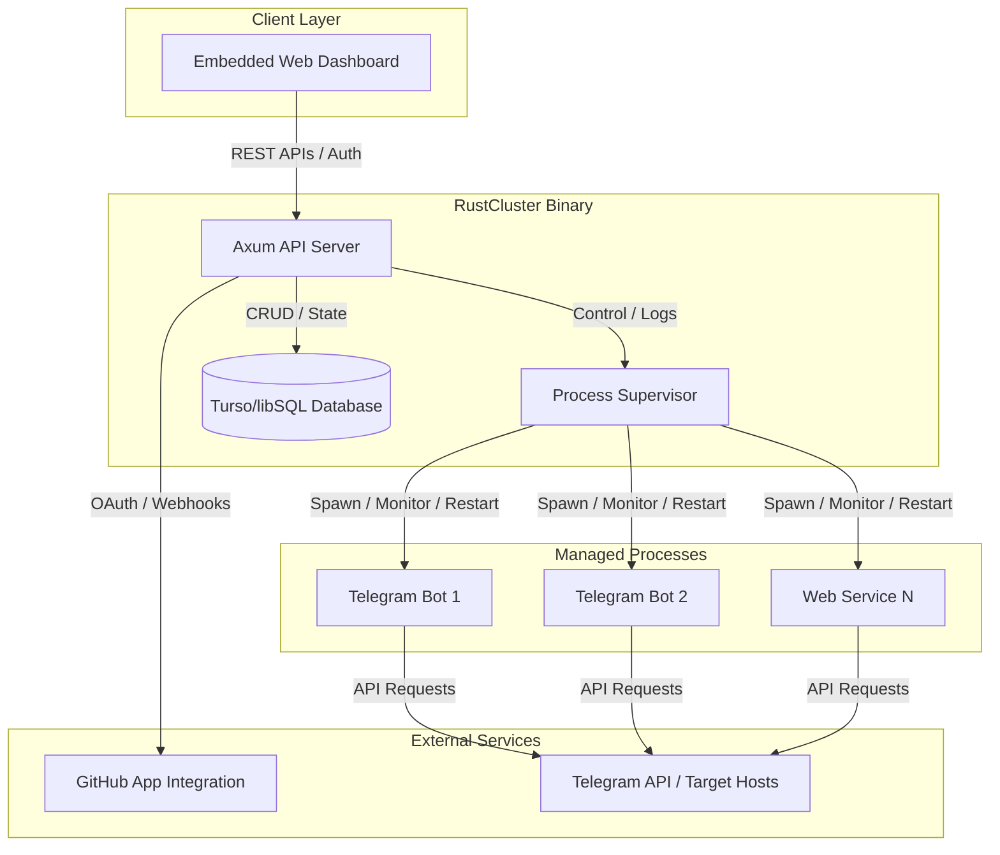

# RustCluster

A high-performance, self-hosted deployment platform built in Rust for managing and running multiple Telegram bots and web applications on a single instance. It provides a premium, developer-friendly interface reminiscent of Vercel, Dokploy, and Koyeb.

## Key Features

* **Multi-Application Deployment**: Deploy and supervise multiple bots/applications concurrently from a single unified server instance.
* **Premium Dashboard**: Developer experience inspired by modern cloud platforms, built with a clean dark-mode system, status indicators, and real-time polling.
* **GitHub App Integration**: Interactive GitHub App registration directly from the web UI to easily list repositories, select branches, and authenticate secure cloning.
* **Continuous Integration**: Auto-deploy deployments on git branch push events via webhook listeners, automatically updating running processes.
* **Robust Process Supervisor**: Spawns and manages applications as background processes, automatically restarting them on unexpected failures with backoff limits.
* **Environment Variable Management**: Dedicated environment variable editor per project, with variables safely stored in the database and masked securely in the UI.
* **Local Database**: Zero-configuration setup leveraging local SQLite databases through the Turso/libSQL database client.
* **Single Binary Build**: The web interface SPA is embedded directly into the compiled Rust binary, enabling single-file deployments.

## Architecture



## Quick Start

### 1. Set Environment Variables

Copy the template configuration file:

```bash
cp .env.example .env
```

Define your administrator details and system preferences:

| Variable | Description | Default |
|:---|:---|:---|
| `ADMIN_EMAIL` | Administrator authentication email | `admin@rustcluster.local` |
| `ADMIN_PASSWORD` | Administrator authentication password | `admin` |
| `ADMIN_USERNAME` | Administrator display username | `admin` |
| `JWT_SECRET` | Secret key for signing authorization tokens | `rustcluster-default-secret` |
| `PORT` | Local port for binding the web server | `8080` |
| `APP_URL` | Public callback URL of your deployment | `http://localhost:8080` |

### 2. Build and Run

Compile the production binary:

```bash
cargo build --release
```

Run the server:

```bash
./target/release/rustcluster
```

Access the dashboard at `http://localhost:8080` and authenticate using the credentials defined in your configuration.

### 3. Connect GitHub App Integration

1. Navigate to the **Settings** tab in the dashboard.
2. Click **Create GitHub App**.
3. You will be redirected to GitHub to register the App with pre-filled settings.
4. Install the newly created App on your user account or organization, granting it access to the repositories you wish to deploy.
5. Your repositories will now populate when creating a new project.

## Cloud Deployment

### Render

The project includes a `render.yaml` configuration out of the box. Create a new Blueprint on Render and link your fork of this repository to deploy automatically.

### Koyeb

To deploy on Koyeb, compile the multi-stage Docker configuration:

```bash
docker build -t rustcluster .
```

### Heroku

A Procfile is included for direct deployment:

```bash
heroku create
git push heroku main
```

## API Reference

All endpoints, except authentication and webhooks, require a token provided via `Authorization: Bearer <token>` or a secure `token` cookie.

| Method | Endpoint | Description |
|:---|:---|:---|
| POST | `/api/auth/login` | Log in and receive a session token |
| GET | `/api/projects` | List all managed projects and active states |
| POST | `/api/projects` | Create a new project configuration |
| GET | `/api/projects/:id` | Get details and supervisor stats for a project |
| DELETE | `/api/projects/:id` | Terminate and delete a project configuration |
| POST | `/api/projects/:id/deploy` | Pull repository updates and run the build pipeline |
| POST | `/api/projects/:id/start` | Start the supervisor process |
| POST | `/api/projects/:id/stop` | Terminate the active process |
| POST | `/api/projects/:id/restart` | Stop and restart the supervisor process |
| GET | `/api/github/repos` | List all accessible GitHub repositories |
| GET | `/api/system/stats` | Retrieve host machine CPU and Memory statistics |

## License

MIT
